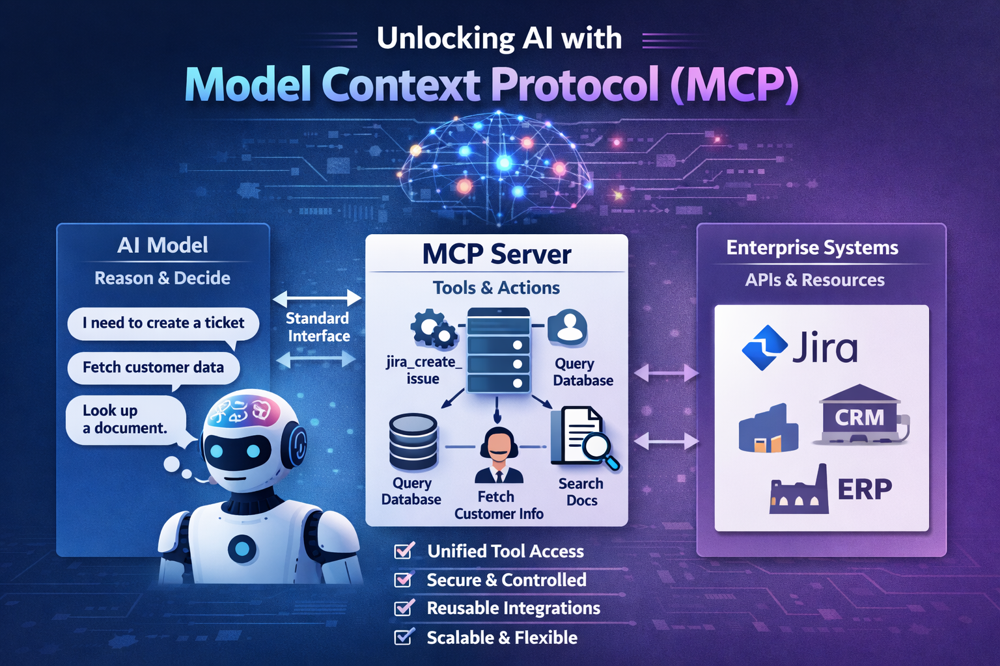

# Model Context Protocol (MCP)

<div align="center">
  
</div>

## Overview

Model Context Protocol (MCP) is a standardized way for AI models to interact with tools, APIs, and enterprise systems.

## Architecture

```
                 ┌──────────────────────────┐
                 │    MCP Client (LLM)      │
                 │(e.g., agent or LLM host) │
                 └────────────┬─────────────┘
                              │
                (JSON‑RPC / MCP Transport)
                              │
                              ▼
                 ┌──────────────────────────┐
                 │    MCP Server Host       │
                 │(hello‑MCP‑world service) │
                 └────────────┬─────────────┘
                              │
          ┌───────────────────┴───────────────────┐
          ▼                                       ▼
 ┌─────────────────┐                    ┌──────────────────┐
 │ Resources       │                    │ Tools            │
 │ (data endpoints)│                    │ (functions)      │
 │ e.g., hello://… │                    │ e.g., echo, debug│
 └─────────────────┘                    └──────────────────┘
                              │
                              ▼
                    Responses / Structured Data
```

## Why MCP matters

- Unified access to external tools
- Better separation between reasoning and execution
- Reusable integrations across AI clients
- More secure handling of credentials and system access

## Example use case

An AI assistant can use MCP to create a Jira ticket, query a database, or search internal documents through a common interface.

## Prerequisites

The environment for this is Ubuntu 24.04.4  

### Install required python packages

```
pip install "fastmcp>=3.0.0rc1"
pip install httpx

```

### Set environment variables

```
export JIRA_BASE_URL=<your JIRA_BASE_URL here>
export JIRA_EMAIL=<JIRA_EMAIL here>
export JIRA_API_TOKEN=<your JIRA_API_TOKEN here>

MCP_URL is hardcoded to  "http://127.0.0.1:8000/mcp" in mcpclient.py, this can be parameterized
```

### Start mcp server in background
it runs on port 8000 which can be changed in the script
```
nohup python  jiramcpserverhttp.py > server.out 2>&1 &
```

check if it is running

```
$ lsof -i :8000
COMMAND  PID USER   FD   TYPE  DEVICE SIZE/OFF NODE NAME
python  7028 root    6u  IPv4 1138597      0t0  TCP localhost:8000 (LISTEN)
```

### Run the mcp client to test it

```
python mcpclient.py   --project SCRUM   --summary "Ticket via CLI"   --description "Created using MCP HTTP client"   --type Task  
```

#### If successful, you should see this output
<Response [200 OK]>
{
  "raw_text": "event: message\r\ndata: {\"jsonrpc\":\"2.0\",\"id\":1,\"result\":{\"content\":[{\"type\":\"text\",\"text\":\"{\\\"success\\\":true,\\\"status_code\\\":201,\\\"data\\\":{\\\"id\\\":\\\"10442\\\",\\\"key\\\":\\\"SCRUM-79\\\",\\\"self\\\":\\\"https://krish-ai-test.atlassian.net/rest/api/3/issue/10442\\\"}}\"}],\"structuredContent\":{\"success\":true,\"status_code\":201,\"data\":{\"id\":\"10442\",\"key\":\"SCRUM-79\",\"self\":\"https://krish-ai-test.atlassian.net/rest/api/3/issue/10442\"}},\"isError\":false}}\r\n\r\n"
}}

